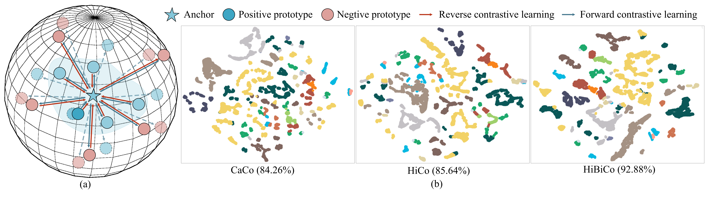

# HiBiCo (TGRS2025)

This is the official implementation of the paper **"Hierarchical and Bidirectional Contrastive Learning for Hyperspectral Image Classification"**.


## Overview

Learning effective representations of hyperspectral images (HSIs) is challenging due to spectral variability. Existing contrastive learning methods face two key limitations:

- **Require careful hyperparameter tuning** (e.g., temperature scaling) to avoid model collapse
- **May ignore category relationships** or lose fine-grained spectral details

HiBiCo addresses these issues via:
- Hierarchical dictionaries.
- Bidirectional contrastive learning.


## Requirement
- torch>=1.7.1
- torchvision>=0.8.2
- numpy>=1.19.5
```bash
pip install -r requirements.txt
```

## Setup
Create a `dataset`, `result` and `test_log` folder in the project directory:
```bash
mkdir dataset
mkdir result
mkdir test_log
```

## Datasets
- IndianPines
- Botswana
- HyRANK-Dioni
- Houston University 2018

## Pretrained models
Please download the corresponding pretrained model and modify the `pretrained` parameter in `linear.py`.

## Linear Probing
We can easily evaluate the linear probing performance of the pre-trained model with
```
python linear.py
```
We can check the output in `./results`.

## Unsupervised Pre-Training
If you wanna train the model by yourself, just run:
```
python main.py
```

## References
Our implementation is based on [CaCo](https://github.com/maple-research-lab/CaCo) and [LSCoSa](https://github.com/sakurashine/LSCoSa). We would like to thank them.

## Citation
lf you find this code available, we would appreciate a kindly citation:
```
@ARTICLE{11050958,
  author={Dong, Jian and Liang, Miaomiao and He, Zhi and Zhou, Chengle},
  journal={IEEE Transactions on Geoscience and Remote Sensing}, 
  title={Hierarchical and Bidirectional Contrastive Learning for Hyperspectral Image Classification}, 
  year={2025},
  volume={},
  number={},
  pages={1-1},
  keywords={Hyperspectral image (HSI);self-supervised learning (SSL);learnable prototypical contrastive learning;hierarchical deep supervision;bidirectional contrastive learning},
  doi={10.1109/TGRS.2025.3582963}}
```

## Contact
If you have any questions or suggestions, welcome to contact me by email: dongj39@mail2.sysu.edu.cn
