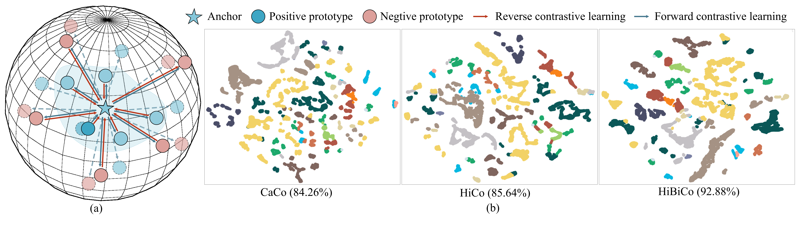
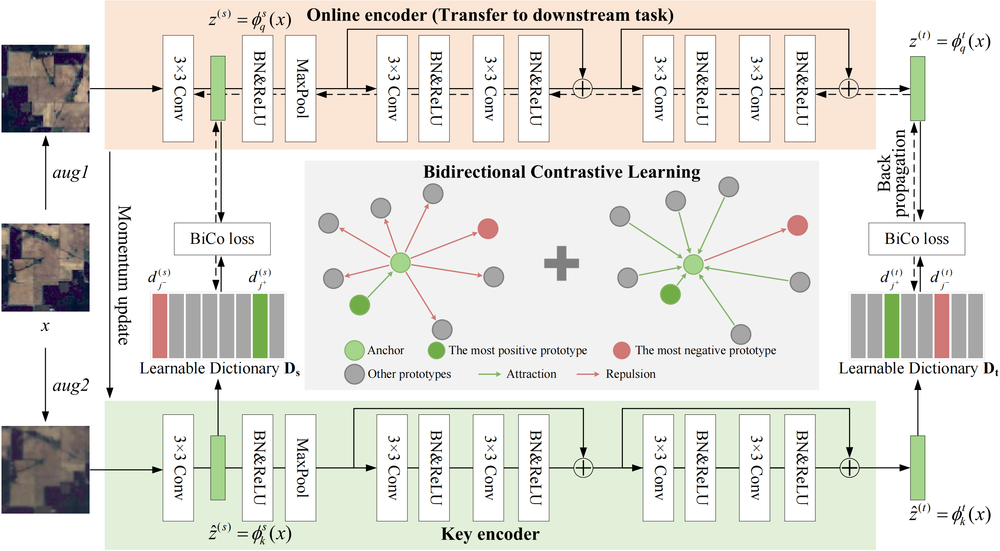

# HiBiCo (TGRS2025)

This is the official implementation of the paper **"Hierarchical and Bidirectional Contrastive Learning for Hyperspectral Image Classification"**.


## Overview

Learning effective representations of hyperspectral images (HSIs) is challenging due to spectral variability, especially under **label-free** conditions. Existing self-supervised contrastive learning methods face two key limitations:

- **Require careful hyperparameter tuning** (e.g., temperature scaling) to avoid model collapse.
- **May ignore category relationships** or lose fine-grained spectral details due to final-layer contrastive loss.

HiBiCo addresses these issues via:
- **Bidirectional contrastive learning**.
- **Hierarchical dictionaries**.



## Requirement
- torch>=1.7.1
- torchvision>=0.8.2
- numpy>=1.19.5
```bash
pip install -r requirements.txt
```

## Setup
Create a `dataset`, `result` and `test_log` folder in the project directory:
```bash
mkdir dataset
mkdir result
mkdir test_log
```

## Datasets
The dataset we used is provided below, you can also replace your own datasets for this project.
- [IndianPines](https://www.ehu.eus/ccwintco/index.php?title=Hyperspectral_Remote_Sensing_Scenes)
- [Botswana](https://www.ehu.eus/ccwintco/index.php?title=Hyperspectral_Remote_Sensing_Scenes)
- [HyRANK-Dioni](https://www.noda.ac.cn/datasharing/datasetDetails/67c96f8cdf65e3259a9c9366)
- [Houston University 2018](https://drive.google.com/drive/folders/1_WPFh2iOrCP0BZ6JbCKsq9eNbGj6fIqE?usp=drive_link)

## Pretrained models
Please download the corresponding pretrained model and modify the `pretrained` parameter in `linear.py`.

[IndianPines](https://drive.google.com/file/d/1zQ8nhpZaDyB5JYo4ERNp87Dp-N89ntly/view?usp=sharing) | [Botswana](https://drive.google.com/file/d/1VMIP_QUBUzHWi03Fuhz8oHtL-G4bG9pn/view?usp=sharing) | [HyRANK-Dioni](https://drive.google.com/file/d/1reaPW_EI37XX9OFuxVFSqfkgf93278vi/view?usp=sharing) | [Houston University 2018](https://drive.google.com/file/d/1KbARJFdgVNP5Q8CEf3NLuj1iPTHulbkI/view?usp=sharing)

## Linear Probing
We can easily evaluate the linear probing performance of the pre-trained model with:
```
python linear.py
```
We can check the output in `./results`.

## Unsupervised Pre-Training
If you wanna train the model by yourself, please run:
```
python main.py
```

## References
Our implementation is based on [CaCo](https://github.com/maple-research-lab/CaCo) and [LSCoSa](https://github.com/sakurashine/LSCoSa). We would like to thank them.

## Citation
If this work aids your research, we would appreciate a kindly citation:
```
@ARTICLE{11050958,
  author={Dong, Jian and Liang, Miaomiao and He, Zhi and Zhou, Chengle},
  journal={IEEE Transactions on Geoscience and Remote Sensing}, 
  title={Hierarchical and Bidirectional Contrastive Learning for Hyperspectral Image Classification}, 
  year={2025},
  volume={},
  number={},
  pages={1-1},
  keywords={Hyperspectral image (HSI);self-supervised learning (SSL);learnable prototypical contrastive learning;hierarchical deep supervision;bidirectional contrastive learning},
  doi={10.1109/TGRS.2025.3582963}}
```

## Contact
If you have any questions, feel free to open an issue, or contact me at dongj39@mail2.sysu.edu.cn.
